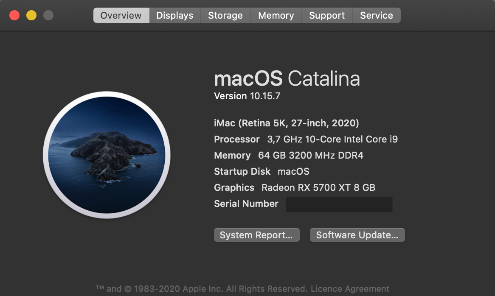

# Hackintosh - Asus ROG Strix Z490-I Gaming (OpenCore)

[](https://github.com/acidanthera/OpenCorePkg/releases/tag/0.6.2)
[](https://www.apple.com/macos/catalina/)
[](https://www.asus.com/Motherboards/ROG-STRIX-Z490-I-GAMING/)
[](#)

This repository is for Hackintosh builds with the **Asus ROG Strix Z490-I Gaming** motherboard using Intel's 10th Gen processors (Comet Lake). 

Everything in terms of the hardware used in this build is working as expected.

Anyone who has the same motherboard can use the EFI of this repository. 

Don’t forget to edit the `EFI/OC/config.plist` file and to generate your own SMBIOS info. See: [Comet Lake Config Guide](https://dortania.github.io/OpenCore-Install-Guide/config.plist/comet-lake.html#platforminfo) for detailed instructions on how to do that. 

I highly recommended that you read the [OpenCore Install Guide](https://dortania.github.io/OpenCore-Install-Guide/) before you get started.

## Hardware

* Motherboard: [Asus ROG Strix Z490-I Gaming](https://www.asus.com/Motherboards/ROG-STRIX-Z490-I-GAMING/)
    * Ethernet: Intel I225-V 2.5Gbit
    * Wi-Fi/BT: Intel AX201NGW (not used in macOS)
    * Audio: Realtek ALCS1220A
* CPU: [Intel Core i9-10900K](https://ark.intel.com/content/www/us/en/ark/products/199332/intel-core-i9-10900k-processor-20m-cache-up-to-5-30-ghz.html)
* GPU: Intel UHD630 (integrated) / AMD Vega 64 (descrete)
* RAM: [Crucial Ballistix DDR4 3200 64GB(32GB×2)](https://www.crucial.com/memory/ddr4/bl2k32g32c16u4bl)
* SSD: [Samsung 970 EVO Plus 2TB M.2 NVMe](https://www.samsung.com/us/computing/memory-storage/solid-state-drives/ssd-970-evo-plus-nvme-m-2-2-tb-mz-v7s2t0b-am/)
* WIFI/BT: [BCM94360NG](https://www.amazon.com/Hackintosh-M-2-NGFF-BCM94360NG-Continuity/dp/B083YXS7VF/ref=sr_1_2?dchild=1&keywords=BCM94360NG&qid=1603741334&sr=8-2) + [NGFF M.2 KEY M to KEY A+E KEY E Adapter](http://www.hwtools.net/Adapter/M2E.html)

## Software

* Bootloader: OpenCore 0.6.2-RELEASE
* OS: macOS Catalina 10.15.7 (19H2)

## What's working

- [x] Intel UHD630 (iGPU)
- [x] AMD Vega 64 (dGPU)
- [x] Audio Realtek ALCS1220A
- [x] Intel I225-V 2.5Gb Ethernet
- [x] Wi-Fi/BT (BCM94360NG)
- [x] USB
- [x] Restart/Shutdown
- [x] Sleep/Wake
- [x] Power Management (Native support)

## Details

### GPU

#### Intel UHD630

HDMI/DP display and audio outputs are all working.

Working with:

* ig-platform-id = `07009B3E`
* device-id = `9B3E0000`

DeviceProperties: 

```xml
<key>PciRoot(0x0)/Pci(0x2,0x0)</key>
<dict>
    <key>AAPL,ig-platform-id</key>
    <data>BwCbPg==</data>
    <key>framebuffer-patch-enable</key>
    <data>AQAAAA==</data>
    <key>framebuffer-stolenmem</key>
    <data>AAAAQA==</data>
    <key>device-id</key>
    <data>mz4AAA==</data>
</dict>
```

#### AMD Vega 64

Native support, no additional configuration required.

### Audio

Working with:

* AppleALC.kext
* FakePCIID.kext
* FakePCIID_Intel_HDMI_Audio.kext
* device-id=`709D0000`
* layout-id=7

DeviceProperties: 

```xml
<key>PciRoot(0x0)/Pci(0x1f,0x3)</key>
<dict>
    <key>layout-id</key>
    <integer>7</integer>
    <key>device-id</key>
    <data>cJ0AAA==</data>
</dict>
```

### Ethernet 

Working with:

* FakePCIID.kext
* FakePCIID_Intel_I225-V.kext
* device-id=`F2150000`

DeviceProperties: 

```xml
<key>PciRoot(0x0)/Pci(0x1C,0x4)/Pci(0x0,0x0)</key>
<dict>
    <key>device-id</key>
    <data>8hUAAA==</data>
</dict>
```

`FakePCIID_Intel_I225-V.kext` is from **SchmockLord**'s repository, details in issue [2.5Gbit Ethernet (Intel I225-V) Don't work #8](https://github.com/SchmockLord/Hackintosh-Intel-i9-10900k-Gigabyte-Z490-Vision-D/issues/8).

### Wi-Fi/BT

Working by using an m.2 M-Key adapter and Apple Airport Card (BCM94360NG).

> Wi-Fi works by default. No additional kexts required when using the BCM94360NG card.

Working with this card is:

- [x] Airdrop
- [x] Handoff
- [x] Sidecar
- [x] Apple Watch unlock
- [x] Apple Magic Keyboard & Mouse

The bottom m.2 slot for the SSD on the motherboard is occupied with the BCM94360NG and the heat sink needs to be removed.

Bluetooth does not work by default. It uses the onboard 9-pin USB2.0 port (HS11) to power the Bluetooth module. USB Port mapping is required to fix this (see the "USB" section).


> The onboard wireless network card (Intel AX201NGW) uses the m.2 E-Key slot and CNVi protocol. Replacing the card with the BCM94360NG does not work due to the CNVi protocol, so don't even bother trying.


### USB

All ports are working fine except for the ones disabled due to the 15 port limit.


USB Ports:

| No. | Type | Port |
|-----|------|------|
| 1   | USB 2.0 | HS12 |
| 2   | USB 2.0 | HS13 |
| 3   | USB 3.2 Gen 1 | HS09/SS09 |
| 4   | USB 3.2 Gen 1 | HS10/SS10 |
| 5   | USB 3.2 Gen 2 | HS05/SS05 |
| 6   | USB 3.2 Gen 2 | HS06/SS06 |
| 7   | USB 3.2 Gen 2 | HS03/SS03 |
| 8   | USB 3.2 Gen 2 | HS04/SS04 |
| 9   | USB 2.0 Hub | HS11 |
| 10  | USB 3.2 Gen 2 | HS01/SS01 |
| 11  | USB 3.2 Gen 1 | HS07/SS07 + HS08/SS08 |

> All ports: HS01 ~ HS14, SS01 ~ SS10, USR1 ~ USR2
>
> HS02: AURA LED Controller /  HS14: Onboard bluetooth
>
> SS04, HS01/SS01, HS07/SS07, HS08/SS08 not yet tested.


You will need to create your own USB mappings using Hackintool.

Example of my own USB Port mappings:


 **Important note regarding the USB port mapping for the internal usb header (HS11) needed to power the Bluetooh module on the BCM94360NG:**

If for some reason (as was the case for me) you don't see HS11 shown in Hackintool you will need to add it manually. **Without the correct HS11 USB port mapping Bluetooth will not work correctly.**

1. Create your USB mappings and export it using Hackintool.

2. Open the exported USBPorts.kext by right clicking on it and select "Show Package Contents

3. Open Contents/info.plist using any text editor.

4. In your text editor search for the text "HS10" and add the following entry right below </dict> of the H10 key:

```xml
<key>HS11</key>
<dict>
	<key>UsbConnector</key>
	<integer>0</integer>
	<key>name</key>
	<string>HS11</string>
	<key>port</key>
	<data>CwAAAA==</data>
</dict>
```

5. Save and close USBPorts.kext.

### Sleep/Wake

Works with DP output and power button. GPRW Patch is used to disable the USB device instant wake.

**Known issues:**
1. Bluetooth has a delay of about 7 seconds after the display is turned on.
2. When using HDMI, the display cannot be woken up.
3. Without enabling GPRW, a keyboard press or mouse click can wake up the display as well, but a second press or click is needed when the light is on, I tried to fix it by following [Keyboard Wake Issues Guide](https://dortania.github.io/USB-Map-Guide/misc/keyboard.html), but didn't work. So my choice is to just use the power button, disable `SSDT-GPRW` if you want to use a keyboard or mouse to wake up.

### F1 Boot Error

Add patch to `Kernel -> Patch`:

```xml
<dict>
    <key>Base</key>
    <string></string>
    <key>Comment</key>
    <string>F1 Startup patch</string>
    <key>Count</key>
    <integer>1</integer>
    <key>Enabled</key>
    <true/>
    <key>Find</key>
    <data>dTMPtw==</data>
    <key>Identifier</key>
    <string>com.apple.driver.AppleRTC</string>
    <key>Limit</key>
    <integer>0</integer>
    <key>Mask</key>
    <data></data>
    <key>MaxKernel</key>
    <string></string>
    <key>MinKernel</key>
    <string></string>
    <key>Replace</key>
    <data>6zMPtw==</data>
    <key>ReplaceMask</key>
    <data></data>
    <key>Skip</key>
    <integer>0</integer>
</dict>
```

### BIOS Settings

> Version: 0707

#### ❌ Disable

* Fast Boot
* VT-d
* CSM
* Intel SGX
* CFG Lock (no option in BIOS, Asus Z490 motherboards are factory unlocked. The `AppleCpuPmCfgLock` and `AppleXcpmCfgLock` quirks are not necessary)

#### ✅ Enable

* VT-x (no option in BIOS, it's enabled by default)
* Above 4G decoding
* Hyper-Threading
* EHCI/XHCI Hand-off
* OS type: Windows UEFI Mode (Clear Secure Boot Keys or choose `Other` type)
* DVMT Pre-Allocated(iGPU Memory): 64MB

### EFI

#### SSDTs

Compiled by following the [Dortania's ACPI Guide](https://dortania.github.io/Getting-Started-With-ACPI/), the `.dls` SSDT files can be found in SSDTS folder. 

* SSDT-AWAC.aml
* SSDT-EC-USBX.aml
* SSDT-PLUG.aml
* SSDT-SBUS-MCHC.aml
* SSDT-RHUB.aml
* SSDT-GPRW.aml (prebuild)

#### Kexts

All kexts with a version tag are downloaded from original repositories.

* VirtualSMC.kext `1.1.5`
* SMCProcessor.kext `1.1.5`
* SMCSuperIO.kext `1.1.5`
* Lilu.kext `1.4.6`
* WhateverGreen.kext `1.4.1`
* AppleALC.kext `1.5.1`
* IntelMausi.kext `1.0.3`
* NVMeFix.kext `1.0.3`
* RadeonBoost.kext `v1.6`
* FakePCIID.kext (from RehabMan `2018-1027`)
* FakePCIID_Intel_HDMI_Audio.kext (from RehabMan `2018-1027`)
* FakePCIID_intel_I225-V.kext (from SchmockLord)
* USBPorts.kext (exported by hackintool)
* USBPorts-All.kext (disabled, include all ports of this board)

## Misc

### Installation

The installation guide in the [OpenCore Install Guide](https://dortania.github.io/OpenCore-Install-Guide/) are quite clear and easy, so there will be no detailed installation tutorials here. Give it some patience and you can build your own EFI.

### Tools

* [GenSMBIOS](https://github.com/corpnewt/GenSMBIOS) for generating SMBIOS info
* [Hackintool](https://github.com/headkaze/Hackintool) for a lot of things
* [MaciASL](https://github.com/acidanthera/MaciASL) for compiling SSDTs
* [MountEFI](https://github.com/corpnewt/MountEFI) for mounting EFI system partition
* [PropereTree](https://github.com/corpnewt/ProperTree) for editing plist file
* [SSDTTime](https://github.com/corpnewt/SSDTTime) for dumping DSDT

<!-- TODO -->
<!-- ### Benchmarks

| Item | Score |
|---|---|
| CPU - Geekbench | [Single / Multi-Core](https://browser.geekbench.com/v5/cpu/2750529): 1218 / 8909 |
| Intel UHD630 - Geekbench | [OpenCL](https://browser.geekbench.com/v5/compute/1092240) / [Metal](https://browser.geekbench.com/v5/compute/1120839): 4826 / 4790 |
| AMD Vega 64 - Geekbench | [OpenCL](https://browser.geekbench.com/v5/compute/1121010) / [Metal](https://browser.geekbench.com/v5/compute/1121020): 75925 / 85089 | -->

### Screenshots


<!--  -->


## Credits

* Acidanthera for [OpenCorePkg](https://github.com/acidanthera/OpenCorePkg)
* Dortania for [OpenCore Install Guide](https://dortania.github.io/OpenCore-Install-Guide/)
* SchmockLord for [Hackintosh-Intel-i9-10900k-Gigabyte-Z490-Vision-D](https://github.com/SchmockLord/Hackintosh-Intel-i9-10900k-Gigabyte-Z490-Vision-D)
* All contributors to the hackintosh system
